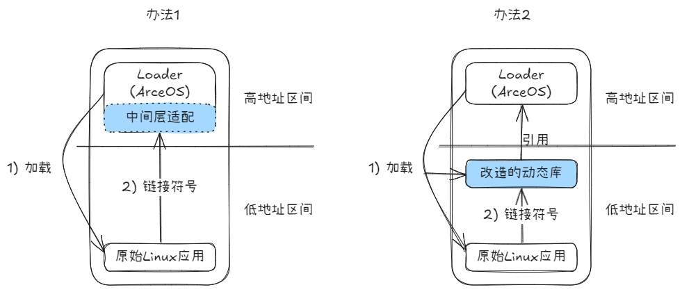

# ArceOS 支持 ELF 文件运行

项目链接：[https://github.com/lkmodel/arceos](https://github.com/lkmodel/arceos)

## 项目安排

### 整体目标

目标：在ArceOS Unikernel形态下，支持加载和运行原始的Linux应用。通过把系统调用转为函数调用，提升系统的整体运行效率；代价是降低了安全性。

核心问题：Linux应用假定自己将运行在Linux环境中，它本身以及依赖库以及工具链都遵循这一假定；现在我们要把应用放到ArceOS之上运行，让应用觉察不到自己的运行环境变化了；所以就需要ArceOS制造出这么一种运行环境。采取的方案是保持libc接口兼容前提下替换libc的实现。


### 两种实现思路



### 后续工作总体规划

1. 完成规划的全部5个阶段，实现Unikernel模式下直接运行Linux的原始应用，通过系统调用转函数调用，达到提升效率的目标。
   + ~~阶段1：支持基于musl静态链接的单应用。应用虽然需要重新编译和链接，但是源码不需要修改。~~
   + 阶段2：支持基于musl动态链接的单应用。原始的二进制应用不需要修改，能够直接运行。
   + 阶段3：支持基于多地址空间从而支持多应用。通过支持`fork`，可以启动其它进程。
   + 阶段4：支持`procfs`和`sysfs`等文件系统。通过支持BusyBox、LTP等测试用例，扩大系统调用支持范围。
   + 阶段5：支持编译应用的工具链从musl到gcc。扩大对常见Linux应用的支持。
2. 优化构建过程，能够体现出当前的组件化内核构建方法相对传统方法的便捷性。

注：其中核心组件来自ArceOS公共组件，仅增加少量面向本场景组件。

## 整体架构

主要函数是`load_elf()`，它负责整个ELF文件的加载过程，根据程序类型分为两个加载路径:`load_exec()`和`load_dyn()`，包含辅助函数如`load_segment()`和`modify_plt()`用于具体的加载和修改操作。

### load_elf() 函数的主要流程

+ 读取ELF文件大小
+ 解析ELF头部
+ 检测是否需要INTERP
+ 根据是否存在INTERP段选择不同的加载方式
+ 返回程序入口点地址

### PIE检测机制

+ 通过检查程序头(Program Headers)中是否存在PT_INTERP段来判断
+ 如果存在PT_INTERP段,则认为是PIE程序
+ 这影响了后续的加载方式和入口点地址计算

### 两种加载方式

a) 静态加载 (load_exec):

+ 针对静态链接的程序
+ 主要加载.text段到指定内存区域
+ 直接使用ELF头中的入口点地址

b) 动态加载 (load_dyn):

+ 针对动态链接的程序
+ 加载所有PT_LOAD类型的段
+ 需要处理PLT(Procedure Linkage Table)重定位
+ 入口点需要加上基地址偏移

### PLT修改机制

+ 解析动态符号表和字符串表
+ 处理.rela.plt重定位段
+ 将外部函数地址填入PLT表中

## 编译运行

### 尝试运行

``` bash
git clone https://github.com/lkmodel/arceos.git
cd arceos
git switch mocklibc
cargo xtask all
```

> 注：如果所需工具已经安装，您可以跳过此步骤。
> 如果在运行 cargo xtask 时遇到网络问题，或希望手动安装musl-cross-make工具，请按照以下步骤操作：
>
> ``` bash
> wget https://musl.cc/riscv64-linux-musl-cross.tgz
> tar zxf riscv64-linux-musl-cross.tgz -C /opt/musl_riscv64
> export PATH=$PATH:/opt/musl_riscv64/bin
> ```
>
> 安装完成后，您可以通过运行以下命令来验证工具链是否正确安装：
>
> ```bash
> which riscv64-linux-musl-gcc
> ```
>

对于`cargo xtask`命令

可以使用`CC=/path/to/gcc`来指定使用的编译器

可用参数:

+ `<APP>` 指定需要运行的APP文件夹名,使用"all"来运行所有应用

可用选项:

+ `--arch <ARCH>`: 目标架构: `x86_64`, `riscv64`, `aarch64`, 目前仅支持`riscv64`。
+ `-l, --log <LOG>`: 日志等级: `warn`, `error`, `info`, `debug`, `trace`, 默认为`warn`。
+ `--qemu-log <QEMU_LOG>`: 是否开启QMEU日志 (日志文件为 "qemu.log"), 默认为`n`。
+ `-t, -ttype <TTYPE>`: 运行测试类型：`static`, `dynamic`, `all`, 默认为`dynamic`。
+ `-s, --snapshot`: 仅审阅编译快照，不运行应用

也可在应用目录下根据情况进行自行修改`config.toml`

现在支持的所有配置如下

```toml
[dev]
rename = "hello" #覆盖文件夹名,例如hello_app文件夹下的hello.c
ttype = "all" #链接方式。特别的,"all"="static"+"dynamic"
snapshot = true #是否为该应用开启快照测试
dynamic_flags = [] #用于动态链接的参数,在开发阶段,默认为所有应用启用了-fPIE,在此处填写可以覆盖
static_flags = [] #用于静态链接的参数
```
## 快照审阅
为了方便调试与测试，引入了[insta](https://insta.rs/)来存储与比对编译生成的应用。
当在`config.toml`中指定`snapshot=true`后，运行xtask编译完成应用后，如果应用的`S` `dump` `elf`发生变化（或本来并没有.snap文件）会在运行前触发审阅。此时有两种选择：
1. 如果明确发生的变化在预期中 <br>
    对于每个snap，按下`a`来接受审阅即可，会自动使用snap.new覆盖原有.snap
2. 如果改动是非预期的，需要进一步比对和修改 <br>
    对于每个snap，按下`s`来暂时跳过审阅来运行应用。xxx_app/snapshot下会出现.snap.new，当确认无误后，可再次运行`cargo xtask xxx_app -s`来审阅快照。
    >cargo_insta的比对是上下排列的，如果需要更好的对比体验，推荐使用[difftastic](https://difftastic.wilfred.me.uk/)或其他工具来获得更好的体验

**注意**：为了健壮的编码与方便他人，如果还有快照尚未审阅就向仓库提交审阅，会被git hooks制止

## 协作开发流程

在参与项目协作时，请按照以下步骤进行操作：

1. Fork 和 Clone 仓库 <br>
   首先，Fork [中心仓库](https://github.com/lkmodel/arceos)到自己的 GitHub 账号下，并 Clone 到本地环境。在后续开发中，基于 mocklibc 分支进行协作，所有的 Pull Request（PR）和合并操作都将在该分支上进行。

2. 提出想法并讨论（建议） <br>
   在正式实现前，可以在项目 1 的微信群中提出自己的想法，与其他开发者进行讨论或协商，以确保思路清晰并避免重复开发。

3. 本地实现与测试 <br>
   根据讨论结果，在本地进行功能的开发与实现，并确保经过充分的本地测试，确保代码质量和功能的正确性。

4. 同步中心仓库并解决冲突 <br>
   在提交 PR 之前，确保自己的 Fork 仓库与中心仓库保持同步。可以通过以下步骤实现：
   + 从中心仓库拉取最新代码，并在本地进行 Rebase：

      ``` bash
      git pull --rebase
      ```

   + 如果存在冲突，解决冲突并重新测试代码。

5. 推送到 Fork 仓库并提交 PR <br>
   将修改后的代码推送到自己 Fork 的仓库：

   ``` bash
   git push
   ```

   随后，在GitHub上提交 Pull Request 到中心仓库的 mocklibc 分支，并等待代码审查和合并。

确保协作开发的有序性和代码库的一致性。

## 重点工作内容

（1）扩大动态链接应用的支持范围，后面不再单独关注静态应用 <br>
（2）优化内部实现，包括简化代码，提升效率，简化构建脚本等等 <br>
（3）完善CI测试等，尤其支持新特性要先加上测试 <br>
（4）对各种bug的fix <br>
（5）尽量复用arceos的现有组件 <br>
（6）手册与文档的完善 <br>

## TODO

+ [ ] 扩大动态链接应用的支持范围
+ [ ] 构建一个成熟可用的CI测试框架
+ [ ] 支持启动运行简易的原生Linux应用
